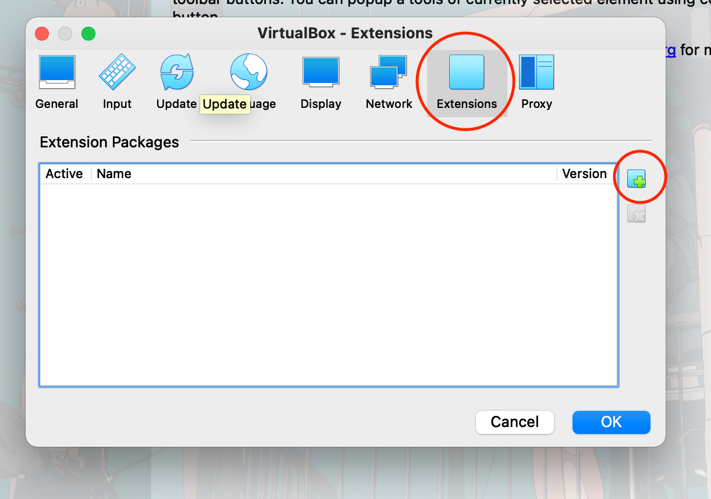

## Firmware Vagrant

Standardizes our development environment through Vagrant VMs. Docker containers are inadequate, since we need to be able to access the host USB ports to flash firmware. We would also like to load kernel modules that are unavailable on a Docker container (e.g., SocketCAN).

The environment consists of an Ubuntu VM with all the cross-compilers and tools pre-installed. USB-over-IP is used as a cross-platform method of accessing the host's USB ports (portable across OSX, Windows, and Linux hosts).

### Installation and Setup

#### Install Vagrant

https://www.vagrantup.com/downloads

On OSX, you can do

```shell
brew install vagrant
```

#### Install Virtualbox

**IMPORTANT:**

* Virtualbox is incompatible with Windows hosts running WSL/WSL2
* The recommended solution for this would be to disable WSL on your system and *try* Vagrant - you might find that you actually prefer it to WSL
  * Vagrant allows you to have multiple VMs running, while WSL locks you into 1
  * Vagrant lets you share folders with your host machine, just like WSL (the performance of the shared folder is much better on Vagrant though imo)
  * If you don't like Vagrant, you can always uninstall and re-enable WSL
* As a fallback, the script `provision_box.sh` can be run manually to install the tools onto your WSL VM, this is not recommended however...
  * You will also not get USB passthrough if you go with this

**Install base VirtualBox**

* https://www.virtualbox.org/wiki/Downloads

**Install the VirtualBox Extension Pack (this is required for USB passthrough)**

1. Scroll down in the above link until you see the following link


2. In your VirtualBox GUI, navigate to "Preferences"


3. Navigate to "Extensions", and click the "add" button



4. Select the previously downloaded extension pack and install it

   


#### Setup VM

Clone the repo and run the following commands:

```shell
git clone https://github.com/waterloop/firmware-vagrant
cd firmware-vagrant

vim vagrantfile 	# (optional) edit the vagrantfile to customize your VM setup
vagrant up --provision
```

Now, you can log into your box by doing:

```shell
vagrant ssh 	# must be ran in the same directory as "vagrantfile"
```

Here are some useful vagrant commands:

```shell
# NOTE: these must be ran in the same directory as the "vagrantfile"
vagrant up 				# start the VM
vagrant halt 			# shutdown the VM
vagrant ssh 			# ssh into the VM

vagrant destroy 	# completely removes the VM from your system (careful with this one)
vagrant up --provision 	# re-provision the VM
```

**Shared Folder**

Vagrant will automatically create a shared folder mounted as `/vagrant` inside the VM, which shares the files in the same directory as the `vagrantfile`.  You can use this to easily transfer files from your VM to your host and vice-versa. You might find creating a symlink to be convienent:

```shell
ln -s /vagrant /home/vagrant/shared
```

#### Upgrading VM from Changes to Vagrantfile

This repo's `vagrantfile` will be updated (we will let you know if this happens). When this happens, pull the changes from git and run `vagrant up --provision`, which should updated your VM with the new changes.

In the worst-case scenario, a `vagrant destroy` will probably fix most things (make sure you back up the files on your VM before you do this however)
